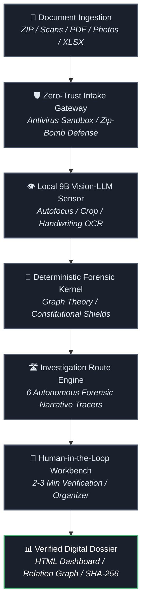

<div align="center">

# 🏛️ SABIR VAULT — Digital Dossier Platform

[](#-contact--evaluation)
[](#-quick-links)
[](./VERIFICATION_WHITEPAPER.md)
[](./VERIFICATION_WHITEPAPER.md)
[](#-english-version)
[](#-english-version)
[](./LICENSE)

> **Structured Documents. Trusted Decisions. 100% Deterministic.**

*Version 5.0.0-ENTERPRISE | August 2026*

</div>

---

**SABIR VAULT** is an enterprise-grade, local-first forensic due diligence platform. It transforms complex, unstructured document collections (PDFs, raw scans, bank statements, handwritten notes, XLSX tables) into verified digital dossiers, interactive relationship graphs, and court-ready evidence matrices.

### 💡 Core Architectural Principle: *AI Reads, Deterministic Code Decides*
- 👁️ **Perception Layer:** Powered by an on-device **9-Billion parameter multimodal Vision-LLM** strictly confined to high-accuracy OCR, handwriting recognition, and notary stamp perception. **AI never makes legal or financial deductions.**
- 🧮 **Deterministic Forensic Kernel:** 100% of entity resolution, graph topologies, biological invariants, financial delta reconciliations, and fraud detections are executed by formal mathematical algorithms with **zero probabilistic hallucinations**.

---

## 📌 Quick Links

- 📜 **[Verification White Paper (v2.7)](./VERIFICATION_WHITEPAPER.md)** — Mathematical proof by exhaustion (141 states, 32 satellites, 376+ checks)
- 🏗️ **[System Architecture](./ARCHITECTURE.md)** — High-level data flow, 9B Vision perception, and core subsystems
- 📦 **[Changelog](./CHANGELOG.md)** — Release notes and macro benchmark milestone results
- 🛡️ **[Security Model](./SECURITY.md)** — Zero-Trust ingestion, antivirus sandbox, and SHA-256 evidence seals
- 📜 **[License Agreement](./LICENSE)** — Enterprise proprietary and confidential license

---

<div align="center">

## 🌍 English Version
### Built for uncompromising enterprise trust.

</div>

**🔒 100% Air-Gapped & Local**  
All processing occurs entirely on private, on-device enterprise hardware (Apple Silicon / CUDA). Zero data leaves your facility. 15W operational power footprint.

**🧮 5-Tier Formal Verification**  
376+ automated checks on every commit, including 141 formally proven mathematical states across 6 universal fraud archetypes.

**🛣️ Six Investigation Routes**  
Autonomous scenario builder mapping financial delta leaks (12M vs 9.5M), corporate control shifts (47-day window), proxy hops, post-mortem signature conflicts, debt concealment, and asset stripping.

**👥 Human-in-the-Loop Workbench**  
Stateful split-view workspace allowing legal counsel to verify anchors, kinship rings, and corporate networks in 2–3 minutes with 1-click confirmation.

---

<div align="center">

## 🇺🇦 Українська версія
### Створено для безкомпромісної корпоративної довіри.

</div>

**🔒 100% Локально та Автономно (Zero-Cloud)**  
Уся обробка відбувається виключно на вашому приватному обладнанні (Apple Silicon / CUDA). Дані клієнта ніколи не виходять у хмару. Споживання всього 15 Ват.

**🧮 5-Рівнева Математична Верифікація**  
376+ автоматичних перевірок на кожному коміті, включаючи 141 математично доведений стан у 6 світових архетипах фінансового шахрайства.

**🛣️ Шість Сюжетів Розслідування**  
Автономний рушій сценаріїв, що розкриває грошові розриви (12M vs 9.5M), зміну контролю за 47 днів до угоди, схеми номіналів («теща-мільйонер»), підписи мерців та фіктивні векселі.

**👥 Робоче місце юриста (Human-in-the-Loop)**  
Спліт-в'ю Органайзер, де адвокат або комплаєнс-офіцер за 2–3 хвилини верифікує родинні та бізнес-зв'язки за прямими цитатами першоджерел.

---

## 🛠️ Platform Architecture



> **Note:** If the Mermaid diagram does not render, view it directly on [GitHub Mermaid](https://mermaid.live/) or refer to [ARCHITECTURE.md](./ARCHITECTURE.md) for a static version.

---

## 🏆 Verified Macro Benchmarks

| Benchmark Dossier | Volume | Target Schemes Planted | Performance & Result |
|---|---|---|---|
| **Industrial M&A Fraud** | 500 documents | 7 corporate & financial traps | ✅ 7/7 signals + 6/6 routes (100% recall) |
| **Corporate Bankruptcy & Asset Stripping** | 295 documents | 7 debt & promissory note schemes | ✅ 6/6 routes + 5M UAH note detected |

**100% deterministic reproducibility** across 800 real-world benchmark documents.

---

## 🎯 Target Solutions

| Solution | Description |
|---|---|
| 📋 **Digital Dossiers** | Transform 500+ unorganized document scans into a structured master dossier within minutes. |
| 🔍 **M&A Due Diligence** | Rapidly audit Data Rooms, asset title history, ownership chains, and missing document compliance. |
| 💸 **Forensic Cashflow & AML** | Trace 3-way matching (Invoice ↔ Act ↔ Bank), VAT carousels, and unbacked promissory notes. |
| ⚖️ **Corporate & Family Compliance** | Uncover conflicts of interest, related-party proxy chains, and generational kinship networks. |
| 🌐 **RWA Legal Clearance** | Prepare tamper-proof legal packages with SHA-256 evidence seals for Real World Asset (RWA) tokenization. |

---

## ⚖️ Important Notice

> [!IMPORTANT]
> **Legal Disclaimer**
>
> SABIR VAULT is an IT analytical software platform and does not constitute a law firm or render legal advice. The platform prepares structured digital dossiers and mathematical risk flags to support professional analysis, auditing, and decision-making by qualified experts.
>
> All forensic findings require **independent legal verification** by qualified professionals. SABIR VAULT assumes no liability for business or legal decisions made based on platform outputs.

---

## 📞 Contact & Evaluation

| Purpose | Contact |
|---|---|
| 🌐 **Website** | [www.sabirvault.com](https://www.sabirvault.com) |
| ✉️ **Enterprise Inquiries** | [contact@sabirvault.com](mailto:contact@sabirvault.com) |
| 🔐 **Security Reports** | [security@sabirvault.com](mailto:security@sabirvault.com) |
| 📌 **Status** | Private Enterprise Development |
| 📜 **License** | Proprietary / Enterprise Evaluation License |

---

## 📄 Repository Structure

```text
sabirvault-docs/
├── README.md                          # This file
├── LICENSE                            # Proprietary License Agreement
├── VERIFICATION_WHITEPAPER.md         # Formal verification documentation
├── ARCHITECTURE.md                    # System architecture overview
├── CHANGELOG.md                       # Release notes & milestones
├── SECURITY.md                        # Security model & best practices
├── ROADMAP.md                         # Product roadmap & timeline
└── docs/
    ├── public/                        # Public documentation
    └── private/                       # Confidential (NDA required)
```

---

<div align="center">

**© 2026 SABIR VAULT. All rights reserved.**  
*Proprietary and Confidential — Enterprise Documentation*

[](https://hits.seeyoufarm.com)

</div>
