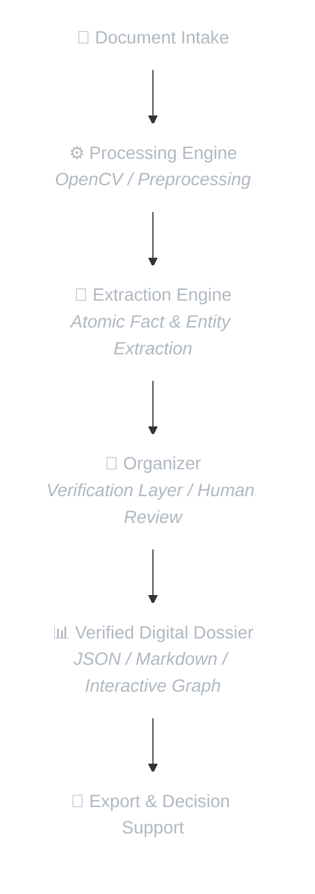

# 🏛️ SABIR VAULT — Digital Dossier Platform

> **Structured Documents. Trusted Decisions.**

---

  
## ОСНОВНІ ПРИНЦИПИ
### Створено для безкомпромісної довіри.

🔒

<h3 style="color: #ffffff; margin: 0 0 12px 0; font-size: 18px;">Локальна обробка</h3>

Уся обробка документів відбувається у вашій приватній інфраструктурі. Обов'язкова хмарна обробка відсутня.

📊

<h3 style="color: #ffffff; margin: 0 0 12px 0; font-size: 18px;">Структурований аналіз</h3>

Перетворює розрізнені документи на структуровані датасети, сутності, зв'язки та цифрові досьє.

👥

<h3 style="color: #ffffff; margin: 0 0 12px 0; font-size: 18px;">Двоетапна верифікація</h3>

Спліт-в'ю робочий простір із роздільними етапами перевірки графа зв'язків та матриць фактів, з автозбереженням аудит-сліду.

🛡️

<h3 style="color: #ffffff; margin: 0 0 12px 0; font-size: 18px;">Безпека за замовчуванням</h3>

Zero-Trust прийом файлів із локальним антивірусним пісочницьким скануванням ClamAV, розпаковкою зашифрованих ZIP та ізольованим виконанням конвеєра.

🔑

<h3 style="color: #ffffff; margin: 0 0 12px 0; font-size: 18px;">Zero-Knowledge прийом (AES-256-GCM)</h3>

Автономна браузерна утиліта шифрування дозволяє клієнтам і адвокатам локально запечатувати архіви у зашифровані .enc-контейнери перед передачею.

---

## 📌 Quick Links

- ️ [Architecture](./ARCHITECTURE.md)
- 🛡️ [Security](./SECURITY.md)
- 🗺️ [Roadmap](./ROADMAP.md)

---

## 🛠️ Platform Architecture

---

## 🎯 Target Solutions

| Solution | Description |
| :--- | :--- |
| 📋 **Digital Dossiers** | Transform 100+ unorganized document scans into a single structured master dossier within minutes. |
| 🔍 **Due Diligence Support** | Rapidly audit asset history, ownership chains, and missing document requirements (Gap Analysis). |
| ️ **Corporate & Family Compliance** | Detect conflicts of interest, related-party transactions, and hidden proxies. |
| 🌐 **RWA Pre-Tokenization** | Prepare structured, tamper-proof document packages for Real World Asset (RWA) tokenization and smart contract integration. |
| 🏛️ **Digital Legacy Archiving** | Preserve verified historical archives for family offices and long-term asset management. |

---

## ⚖️ Important Notice

> [!IMPORTANT]
> **Legal Disclaimer**  
> SABIR VAULT is an IT analytical software platform and does not constitute a law firm or render legal advice.  
> The platform prepares structured digital dossiers and risk flags to support professional analysis, auditing, and decision-making by qualified experts.

---

## 📞 Contact & Evaluation

🌐 **Website:** [www.sabirvault.com](http://www.sabirvault.com)  
✉️ **Email:** [contact@sabirvault.com](mailto:contact@sabirvault.com)  
📌 **Status:** Private Enterprise Development  
📜 **License:** Proprietary / Enterprise Evaluation  

 
© 2026 SABIR VAULT. All rights reserved.

