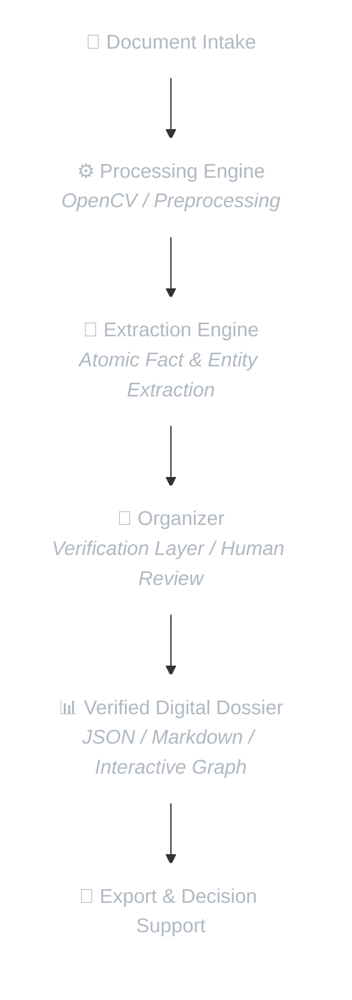

# 🏛️ SABIR VAULT — Digital Dossier Platform

> **Structured Documents. Trusted Decisions.**

---

**SABIR VAULT** is an enterprise-grade local platform for automated document processing, entity extraction, relationship graph construction, and digital dossier generation.

Designed for organizations and professionals working with large volumes of confidential documentation in controlled, privacy-first environments.

---

## 📌 Quick Links

- 🏗️ [Architecture](./ARCHITECTURE.md)
- 🛡️ [Security](./SECURITY.md)
- 🗺️ [Roadmap](./ROADMAP.md)

---

## 🌍 English Version
### Built for uncompromising trust.

**🔒 Local Processing**  
All document processing occurs entirely within your private infrastructure. No mandatory cloud processing.

**📊 Structured Intelligence**  
Transforms disconnected documents into structured datasets, entities, relationships, and digital dossiers.

**👥 Dual-Stage Verification**  
Stateful Split-View workspace with separate verification passes for entity relationship graphs and deep fact matrices, with auto-save audit trail.

**🛡️ Security by Design**  
Zero-Trust file ingestion featuring local ClamAV antivirus sandboxing, encrypted ZIP unpacking, and memory-isolated pipeline execution.

---

## 🇺🇦 Українська версія
### Створено для безкомпромісної довіри.

**🔒 Локальна обробка**  
Уся обробка документів відбувається у вашій приватній інфраструктурі. Обов'язкова хмарна обробка відсутня.

**📊 Структурований аналіз**  
Перетворює розрізнені документи на структуровані датасети, сутності, зв'язки та цифрові досьє.

**👥 Двоетапна верифікація**  
Спліт-в'ю робочий простір із роздільними етапами перевірки графа зв'язків та матриць фактів, з автозбереженням аудит-сліду.

**🛡️ Безпека за замовчуванням**  
Zero-Trust прийом файлів із локальним антивірусним пісочницьким скануванням ClamAV, розпаковкою зашифрованих ZIP та ізольованим виконанням конвеєра.

---

## 🛠️ Platform Architecture

---

## 🎯 Target Solutions

| Solution | Description |
| :--- | :--- |
| 📋 **Digital Dossiers** | Transform 100+ unorganized document scans into a single structured master dossier within minutes. |
| 🔍 **Due Diligence Support** | Rapidly audit asset history, ownership chains, and missing document requirements (Gap Analysis). |
| ⚖️ **Corporate & Family Compliance** | Detect conflicts of interest, related-party transactions, and hidden proxies. |
| 🌐 **RWA Pre-Tokenization** | Prepare structured, tamper-proof document packages for Real World Asset (RWA) tokenization and smart contract integration. |
| 🏛️ **Digital Legacy Archiving** | Preserve verified historical archives for family offices and long-term asset management. |

---

## ⚖️ Important Notice

> [!IMPORTANT]
> **Legal Disclaimer**  
> SABIR VAULT is an IT analytical software platform and does not constitute a law firm or render legal advice.  
> The platform prepares structured digital dossiers and risk flags to support professional analysis, auditing, and decision-making by qualified experts.

---

## 📞 Contact & Evaluation

🌐 **Website:** [www.sabirvault.com](http://www.sabirvault.com)  
✉️ **Email:** [contact@sabirvault.com](mailto:contact@sabirvault.com)  
📌 **Status:** Private Enterprise Development  
📜 **License:** Proprietary / Enterprise Evaluation  

 
© 2026 SABIR VAULT. All rights reserved.

