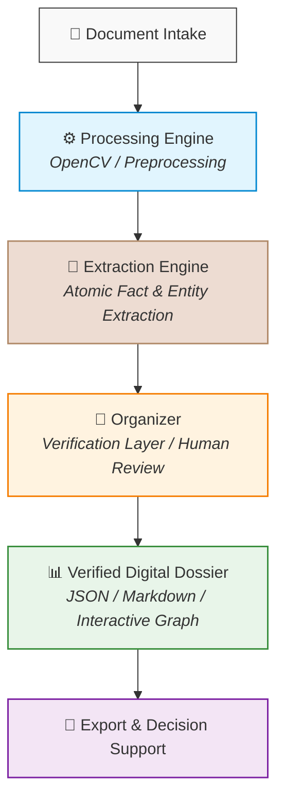

# 🏛️ SABIR VAULT — Digital Dossier Platform

> **Structured Documents. Trusted Decisions.**

---

**SABIR VAULT** is an enterprise-grade local platform for automated document processing, entity extraction, relationship graph construction, and digital dossier generation.

Designed for organizations and professionals working with large volumes of confidential documentation in controlled, privacy-first environments.

---

## 📌 Quick Links

- 🏗️ [Architecture](./ARCHITECTURE.md)
- 🛡️ [Security](./SECURITY.md)
- 🗺️ [Roadmap](./ROADMAP.md)

---

## 🌟 Core Principles

| Principle | Description |
| :--- | :--- |
| **🔒 Local First** | All processing takes place entirely within your infrastructure. Client documentation never leaves your controlled environment. |
| **🛡️ Security by Design** | Built-in Zero-Trust file ingestion, local anti-virus scanning, and in-memory data isolation. |
| **📊 Structured Intelligence** | Unstructured document collections (scans, PDFs, photos, forms) are transformed into unified JSON schemas and relational graphs. |
| **👥 Human-in-the-Loop** | Automated extraction is paired with a dedicated Verification Layer (Organizer) for expert review and confirmation. |

---

## 🛠️ Platform Architecture

---

## 🎯 Target Solutions

| Solution | Description |
| :--- | :--- |
| 📋 **Digital Dossiers** | Transform 100+ unorganized document scans into a single structured master dossier within minutes. |
| 🔍 **Due Diligence Support** | Rapidly audit asset history, ownership chains, and missing document requirements (Gap Analysis). |
| ⚖️ **Corporate & Family Compliance** | Detect conflicts of interest, related-party transactions, and hidden proxies. |
| 🌐 **RWA Pre-Tokenization** | Prepare structured, tamper-proof document packages for Real World Asset (RWA) tokenization and smart contract integration. |
| 🏛️ **Digital Legacy Archiving** | Preserve verified historical archives for family offices and long-term asset management. |

---

## ⚖️ Important Notice

> [!IMPORTANT]
> **Legal Disclaimer**  
> SABIR VAULT is an IT analytical software platform and does not constitute a law firm or render legal advice.  
> The platform prepares structured digital dossiers and risk flags to support professional analysis, auditing, and decision-making by qualified experts.

---

## 📞 Contact & Evaluation

🌐 **Website:** [www.sabirvault.com](http://www.sabirvault.com)  
✉️ **Email:** [contact@sabirvault.com](mailto:contact@sabirvault.com)  
📌 **Status:** Private Enterprise Development  
📜 **License:** Proprietary / Enterprise Evaluation  

 
© 2026 SABIR VAULT. All rights reserved.

