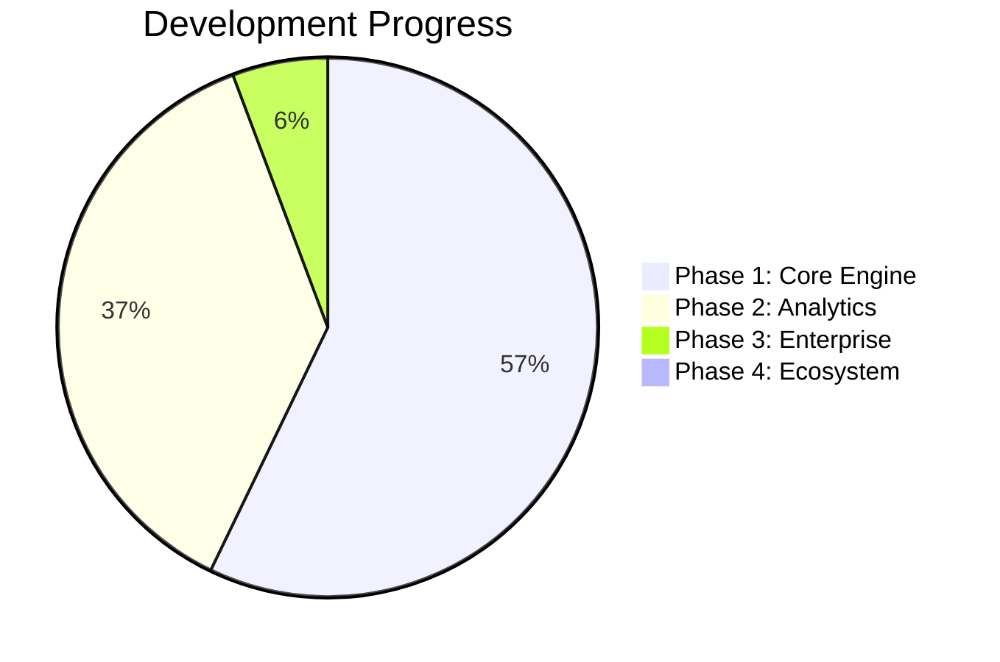

# 🚀 SABIR VAULT — Product Roadmap

> **Enterprise Document Intelligence Platform**

---

## 📍 Phase 1: Core Engine (Completed)

- [x] Stateful Multi-Document Extraction Pipeline
- [x] Forensic Graph Resolver
- [x] Computer Vision Preprocessing
- [x] Automated Gap Analysis
- [x] Interactive Verification Workspace
- [x] Cryptographic Audit Trail
- [x] Zero-Trust Ingestion Gateway

---

## 📍 Phase 2: Hybrid Analytics (In Progress)

- [x] Financial Flow Audit
- [x] Influence & Power Centrality Analysis
- [x] Conflict of Interest Detection
- [x] Self-Learning JSON Advisor
- [ ] Multi-Language Schema Support
- [ ] Advanced Pattern Recognition

---

## 📍 Phase 3: Enterprise Scaling (Q3–Q4 2026)

- [ ] On-Premise Hardware Appliance
- [ ] REST API Gateway
- [ ] Real-Time Progress Streaming
- [ ] Blockchain Proof of Due Diligence
- [ ] CRM & Case Management Integration
- [ ] Partner Program

---

## 📍 Phase 4: Ecosystem Expansion (2027)

- [ ] Vertical Industry Templates
- [ ] Automated Compliance Reporting
- [ ] AI-Powered Risk Prediction
- [ ] Global Partner Network
- [ ] Enterprise Marketplace

---

## 📊 Progress Overview

---

## 📞 Contact

🌐 **Website:** [www.sabirvault.com](http://www.sabirvault.com)  
✉️ **Email:** [contact@sabirvault.com](mailto:contact@sabirvault.com)

 
© 2026 SABIR VAULT. All rights reserved.

